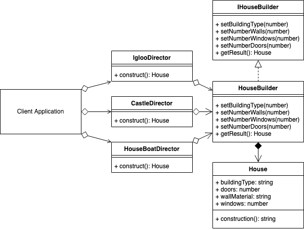

# [Builder Design Pattern in TypeScript](https://sbcode.net/typescript/builder/)

## Builder Use Case

- Using the Builder Pattern in the context of a House Builder.
- There are multiple directors that can create their own complex objects.
- The builder can construct complex objects in any order and include/exclude whichever parts it likes.

### Summary

- The Builder pattern is a creational pattern that is used to create more complex objects than you'd expect from a factory.
- The Builder pattern should be able to construct complex objects in any order and include/exclude whichever available components it likes.
- For different combinations of products than can be returned from a Builder, use a specific Director to create the bespoke combination.
- You can use an Abstract Factory to add an abstraction between the client and Director.

  

